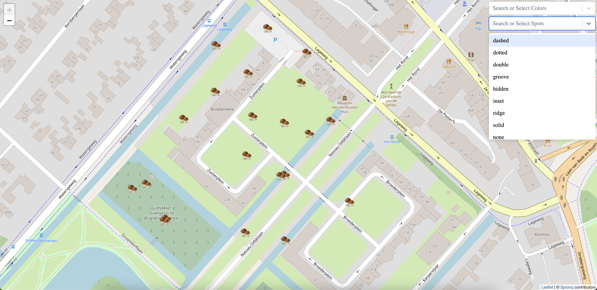

# SpronQ ❤️ Frontend Assessment

In this layout, I supposed to display a number of mushrooms on the map and also that they have two filters, color and type of spot.

## Demo 💻

Check it out using link bellow.

https://alirezakhosraviyan.github.io/mushroom-spronq/

## Screenshots 📸


## Project Structure 🏗
```bash
.
├── app.tsx
├── assets
│   ├── global.css
│   └── images
│       ├── mushroom-2x.png
│       └── mushroom.png
├── components
│   ├── core
│   │   ├── loading
│   │   │   ├── index.tsx
│   │   │   └── styles.module.css
│   │   ├── map
│   │   │   ├── map.tsx
│   │   │   └── marker.tsx
│   │   └── select-box
│   │       ├── index.tsx
│   │       └── style.module.css
│   └── layout
│       └── index.tsx
├── index.tsx
├── react-app-env.d.ts
├── reportWebVitals.ts
├── state
│   ├── action-creators
│   │   ├── fake-api.ts
│   │   └── index.ts
│   ├── action-types
│   │   └── index.ts
│   ├── actions
│   │   └── index.ts
│   ├── dto
│   │   └── index.ts
│   ├── index.ts
│   ├── reducers
│   │   ├── index.ts
│   │   └── mushroom-reducers.ts
│   └── store.ts
├── utils
│   └── get-center-of-geolocations.ts
└── views
    ├── index.ts
    └── mushrooms
        ├── components
        │   ├── mushrooms-filters.tsx
        │   ├── mushrooms-map.tsx
        │   ├── mushroon-detail.tsx
        │   └── styles
        │       ├── mushrooms-detail.module.css
        │       ├── mushrooms-filters.module.css
        │       └── mushrooms-map.module.css
        ├── index.tsx
        └── styles.module.css

```

## Key Points 💫🌟

-   Working with Leaflet layers
-   Finding center of coordinates instead of random coordinate in list
-   Working with Redux
-   Used Typescript
-   Follow ComponentBased guidelines
-   Follow HOC guidelines

## Installation and Run 👨‍💻
```bash
    git clone https://github.com/alirezakhosraviyan/mushroom-spronq.git

    cd mushroom-spronq

    npm i 

    npm run start
```

Check out http://localhost:3000


## 🚀 About Me
Please check my linkedin profile ... :)

https://www.linkedin.com/in/alirezakhosravian/

